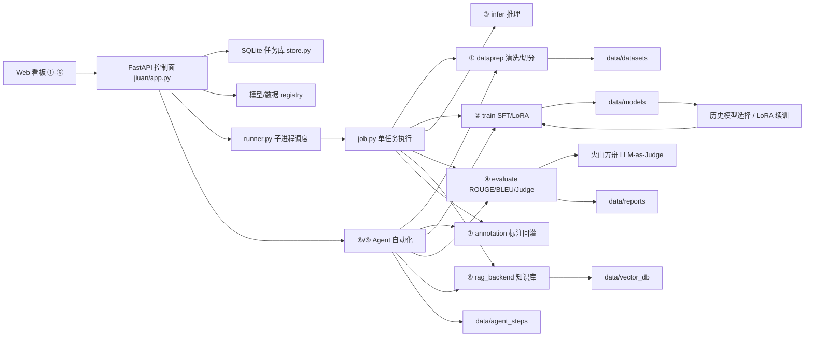
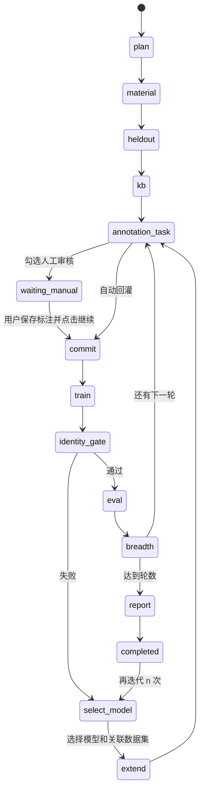

# jiuan-lite 训推平台全项目跑通演示文稿

日期：2026-07-20  
演示对象：老板 / 项目负责人  
演示定位：通用语言模型训练闭环 demo / SFT 验证平台  
演示入口：`http://127.0.0.1:8000/?v=custom9`  
当前本机状态：`/health` 已返回 `status=ok`、`mock_mode=false`

---

## 1. 开场：一句话汇报

我们已经做出一个对标久安“标-训-推-评”核心链路的轻量训推平台骨架。它不是单页静态 demo，而是可以在本机真实跑通数据准备、SFT/LoRA 训练、模型推理、指标评测、gap 分析、标注回灌、RAG 知识库和 Agent 自动迭代的闭环。

当前平台重点解决的是“语言模型训练闭环是否能跑通、是否能复现、是否能解释每次迭代为什么做”的问题。它可以用 Qwen2.5-0.5B-Instruct 做真实本地验证，也支持 mock 模式快速演示完整流程。

汇报时需要强调边界：这是对标久安的最小可跑通骨架和二次开发验证平台，不是已经具备久安完整生产级能力的系统。

---

## 2. 当前成果总览

| 方向 | 当前成果 | 演示价值 | 未来改进方向 |
|---|---|---|---|
| 数据准备 | 支持 JSONL 文件或已有数据集作为新增 source，完成清洗、去重、train/valid 切分；通过 `新增 source + 历史 parent = 新数据集` 记录血缘 | 能明确解释本轮新增数据和历史数据分别来自哪里，避免误合并和训练/评测混用 | 接入标注平台 Label Studio（`https://labelstud.io/`）：先由平台生成待标注 JSON/JSONL，导入 Label Studio；标注完成后导出 JSON/JSONL，再在本平台指定 source 路径进入当前 dataprep 流程；进一步通过 webhook 或轮询实现标注完成后自动同步、自动回灌 |
| 模型训练 | 支持 `hf`、`LLaMA-Factory`、`mock` 后端和 LoRA/SFT；追加迭代可选择历史模型，自动继承其数据集并加载 LoRA adapter 继续训练 | 能用本机 0.5B 模型验证训练链路，也能从失败任务回退到指定模型继续，不必从头训练 | 在更好 GPU 上升级到 7B/14B 级基底模型和更大样本；使用 QLoRA、DeepSpeed/FSDP、多 GPU、FlashAttention、混合精度和训练断点恢复；补齐训练曲线、显存占用、吞吐、loss 对比和模型版本管理 |
| 模型推理 | 支持 transformers、本地 mock、预留 vLLM 接口 | 能展示模型训练后如何调用 | 使用 vLLM 部署 LoRA/合并模型，实现更高吞吐、更低延迟、OpenAI 兼容 API 调用、批量并发、流式输出、token 计量和服务化压测 |
| 模型评测 | 支持 ROUGE-L、BLEU、LLM-as-Judge、gap 分析；Judge 采用批量评分、429 退避重试和明确状态展示 | 能说明模型好坏不是靠主观感觉；Judge 失败时显示失败/额度原因，不再误报为“关闭”或成功 | 接入 OpenCompass / lm-evaluation-harness 类评测框架，扩充固定 held-out、广度验证、回归测试、人工抽检和 Judge 复核；增加前后模型对比、置信区间、失败原因分类和 impact 回灌效果验证 |
| 迭代看板 | 按模型/数据血缘展示多版本指标变化 | 能展示“为什么继续补数据、补哪里” | 对比成熟同行产品后，本项目还缺实验矩阵、曲线看板、版本 diff、审批发布、权限审计和回归预警；后续接 MLflow/TensorBoard 风格实验管理，展示 dataset diff、model diff、指标趋势、gap 消解率和线上反馈 |
| 标注回灌 | gap 生成标注任务，人工修改后回灌成新训练集 | 能连接真实业务标注流程 | 增加标注审核态、多人协作、标注一致性统计、难例加权策略、回灌前质量门禁、回灌后 impact 验证；与 Label Studio webhook 打通，形成“标注完成 -> 自动拉取 -> 自动 commit -> 触发下一轮训练” |
| RAG 知识库 | 支持 collection 切换、TF-IDF 离线检索、知识缺口记录 | 能补足小模型硬记不足的问题 | 在 GPU/正式环境中升级到 BGE / sentence-transformers 语义向量，接 ChromaDB、FAISS 或 Milvus；增加文档版本、引用出处、重排模型、召回评测、知识冲突检测和按业务 collection 权限隔离 |
| 专用 Agent | ⑧ 生物专家三轮自动训练、一键保通打包 | 能展示垂直场景自动跑通 | 定位为固定行业模板 Agent：适合把已经明确的数据结构、评测集、知识库和流程封装成一键按钮；后续可复制为应急、客服、合同等专用 Agent，重点是稳定复现和交付演示 |
| 通用 Agent | ⑨ 输入任意强化方向，自动生成数据、验证集、知识库和迭代训练；支持人工暂停、身份门禁、选择历史模型恢复续训 | 能解决“不能只训练生物”的普遍性问题，并能从失败轮次选择恢复点继续 | 定位为通用编排 Agent：通过自然语言目标生成方案，调用 dataprep/train/eval/RAG/annotation 等模块；后续重点是接真实业务数据、人工审核、可配置训练框架、自动查缺补漏和跨任务复用 |

截至 2026-07-20，当前本机 registry 中可选择的唯一训练模型为 26 个、数据集为 24 个。模型训练记录、评测记录和数据集血缘分开保存，避免把重复评测记录误算成模型数量。

未来改进补充说明：

- 标注平台优先接 Label Studio（`https://labelstud.io/`）。当前项目已经有 jsonl 标注桥接和 Label Studio 占位后端，下一步可以把 Agent 生成的待标注 JSON/JSONL 导入 Label Studio；标注完成后通过导出文件指定 `source` 路径，或通过 `POST /annotation/webhook/ls` 自动同步到本平台。
- 更好的 GPU 设备主要提升两件事：一是能训练更大的基底模型和更多样本，二是能用 vLLM 把推理做成真正的高并发服务。CPU 适合证明流程，GPU 才适合证明效果和吞吐。
- 训练侧未来重点不是只把 epoch 加大，而是补齐训练工程：QLoRA、DeepSpeed/FSDP、多 GPU、混合精度、断点恢复、训练曲线、模型版本和实验对比。
- 评测侧未来重点是从“单次分数”升级为“评测体系”：固定 held-out、广度验证、回归测试、Judge 复核、人工抽检、impact 回灌验证和失败原因分类。
- 当前火山方舟 Judge 使用 OpenAI 兼容地址 `https://ark.cn-beijing.volces.com/api/plan/v3`，请求模型别名为 `ark-code-latest`，当前对应具体模型为 `deepseek-v4-flash`。评测已改为整批一次请求并支持 429 退避；账户额度耗尽时会明确显示 `AccountQuotaExceeded`，不会把失败伪装成“关闭”。
- 专用 Agent 适合固定场景交付，强调稳定、可复现、一键跑通；通用 Agent 适合探索新方向，强调参数解释、数据生成/接入、人工审核、自动迭代和可扩展编排。两者底层都复用当前 FastAPI + pipeline + worker + registry + RAG + annotation 架构。

---

## 3. 现场演示路线

### 3.1 演示前检查

```powershell
.\workflow.ps1 status
```

预期结果：

- 服务健康检查成功。
- `mock_mode=false`，代表当前具备真实模型依赖，不是纯 mock 页面。
- 最近任务可查询。

如服务未启动：

```powershell
.\workflow.ps1 serve
```

如需要一键跑标-训-推-评：

```powershell
.\workflow.ps1 run
```

这会调用服务端 `POST /workflow`，在一个可审计任务里串起数据准备、训练、推理和评测。

### 3.2 Web 演示顺序

1. 打开 `http://127.0.0.1:8000/?v=custom9`。
2. 先展示顶部状态和 ①到⑨页面结构，让老板看到这不是单功能工具，而是完整闭环平台。
3. 快速过一遍 ①标、②训、③推、④评，说明每个页面对应久安里的一个核心模块。
4. 重点展示 ⑤迭代、⑥RAG、⑦标注，说明“模型变好”来自数据闭环和知识补全，不只是调参数。
5. 展示 ⑧ 生物专家 Agent，说明垂直场景已经完整跑通过三轮自动训练。
6. 最后重点展示 ⑨ 通用训练 Agent，说明它把生物专用流程抽象成可面向不同业务方向的通用训练流程。

---

## 4. ⑨ 通用训练 Agent 演示脚本

### 4.1 演示要点

⑨ 页面的价值是降低训练门槛：用户不需要提前准备完整数据集和评测集，只需要描述“希望强化大模型的方向”，系统就能生成训练方案，并按参数自动创建 source、held-out 验证集、知识库、标注任务、训练数据集、模型、评测报告和广度分析报告。

同时，系统支持人工介入。正式训练不应该完全依赖 Judge 合成数据，平台已经提供默认不勾选的人工审核开关：

- 初代内容是否需要人工标注审核。
- 后续每轮回灌内容是否需要人工审核。
- 已暂停任务可回到 ⑦ 标注页修改 annotation，保存后再回 ⑨ 点击“继续运行”。
- 已完成或失败任务可以在“从哪个模型继续”下拉框选择恢复模型，再点击“我想再迭代 n 次”。系统自动找到该模型对应的数据集，并加载该模型的 LoRA adapter 续训。
- 每轮训练后自动执行身份回归门禁，检查“你是谁”“来自哪个单位”等问题；出现虚构政府部门、企业或机构身份时停止发布该轮模型。

### 4.2 操作步骤

1. 在“强化方向”里输入业务目标，例如：

   `客服质检：识别服务态度、违规承诺、流程遗漏和整改建议`

2. 点击“让 Agent 生成方案”。

   这里会生成：

   - 场景名。
   - source 名字。
   - 迭代名前缀。
   - 数据集名前缀。
   - 模型名前缀。
   - 基底模型路径。
   - 输出目录。
   - 样本数、验证样本数、迭代轮数。
   - 训练后端、设备、epochs、max sequence length。
   - 参数说明与风险提示。

3. 根据演示环境选择参数：

   - 本机快速演示：样本数 20 左右，CPU，Qwen2.5-0.5B，1 个 epoch。
   - 正式训练：提高样本数，使用更强基底模型和 GPU。
   - 若要证明人工闭环：勾选“首轮人工审核”和“后续回灌人工审核”。

4. 点击“启动通用训练”。

5. 如果进入 `waiting_manual`：

   - 跳转到 ⑦ 标注回灌。
   - 加载当前标注任务。
   - 修改或确认 annotation。
   - 保存后回到 ⑨。
   - 点击“继续运行”。

6. 观察当前进度：

   - 当前处于第几轮。
   - 当前阶段是生成数据、标注、回灌、训练、评测还是广度分析。
   - 每轮产出的 dataset id、model id、metrics、gap 数量、breadth report。
   - 所有步骤报告路径。

7. 完成后点击“我想再迭代 n 次”，演示追加迭代能力。

8. 如果某轮训练被身份门禁或评测门禁判失败：

   - 在“从哪个模型继续”中选择上一个合格模型或其他历史模型。
   - 页面同时显示该模型的身份校验状态和关联 dataset id。
   - 设置追加轮数后再次点击“我想再迭代 n 次”。
   - 系统记录 `source_model_id -> parent_dataset -> new model`，并从所选 LoRA 权重继续训练。

9. 在 ④ 评测页选择“LLM-as-Judge=开启”时，重点观察 Judge 状态：

   - `已评分`：显示平均分和实际评分样本数。
   - `失败`：显示 HTTP、额度或返回解析错误。
   - `不可用`：配置或服务不可用，未执行。
   - `关闭`：用户明确关闭。

   明确选择“开启”后，Judge 调用失败会使评测任务失败，而不是只输出 ROUGE 后假装评测完整。

### 4.3 关键解释话术

老板可能关心“自动生成是不是不可靠”。回答口径：

> 平台支持 Judge 自动补全和扩增数据，但正式训练不建议完全依赖合成数据。现在的设计是：用户或标注人员提供主要数据，Judge 用于补充候选样本、生成 held-out 验证题、扩展边界场景和辅助查缺补漏；所有关键回灌都可以暂停给人审核，审核后再进入训练。

老板可能关心“怎么知道回灌有效”。回答口径：

> 系统不会把回灌样本直接拿去当评测题。回灌效果主要通过固定 held-out 评测集、广度验证集和 impact 回灌效果验证来判断。固定 held-out 看整体能力是否提升，广度验证看新模型是否有覆盖盲区，impact 验证专门看这批回灌解决的薄弱点是否真的改善。

老板可能关心“为什么任务显示 failed，反而是成果”。回答口径：

> 训练进程成功只代表权重产出了，不代表模型可以发布。客服试训中模型回答“来自阿里云”，身份回归门禁因此阻止该轮成为最终模型。这证明平台已经从“训练完成即成功”升级为“训练完成后还要过质量门禁”。用户可以选择上一个模型继续补数据和续训，不必整套流程重来。

---

## 5. 已跑通证据

### 5.1 基础应急场景真实迭代链

早期链路使用同一固定 held-out 评测集和火山方舟 Judge，完成了多版本数据驱动迭代。

| 版本 | 数据量 | 新增 | ROUGE-L | BLEU-1 | Judge | 说明 |
|---|---:|---:|---:|---:|---:|---|
| v1 | 29 | +29 | 0.2547 | 0.3533 | 3.31 | 基线：火灾、地震、急救 |
| v2 | 36 | +7 | 0.2751 | 0.3878 | 3.56 | 补危化品 |
| v3 | 44 | +8 | 0.2859 | 0.3917 | 3.44 | 补公共卫生、洪涝台风 |
| v4 | 47 | +3 | 0.2834 | 0.4028 | 3.44 | 严格 held-out，无泄漏 |

可讲结论：v1 到 v3 指标整体提升，说明“评测发现问题 -> 补数据 -> 训练新模型 -> 再评测”的闭环有效。v4 小幅波动是小样本和严格 held-out 下的正常现象，不应包装成虚假提升。

### 5.2 生物专家三轮自动训练

⑧ Agent 已跑通过全新生物学场景：自动生成 `source=生物知识` 的 110 条预标注池，拆成三轮标注回灌，生成生物知识库并完成训练、推理抽检、固定评测和广度分析。

| 版本 | 数据集 | 模型 | ROUGE-L | BLEU-1 | BLEU-2 | Judge |
|---|---|---|---:|---:|---:|---:|
| bio-v1 | `bio-v1-生物学知识-20260716-163519` | `bio-v1-生物专家-20260716-163522` | 0.1565 | 0.2035 | 0.0705 | 2.091 |
| bio-v2 | `bio-v2-生物学知识-20260716-164557` | `bio-v2-生物专家-20260716-164601` | 0.2136 | 0.3611 | 0.1434 | 2.545 |
| bio-v3 | `bio-v3-生物学知识-20260716-165449` | `bio-v3-生物专家-20260716-165453` | 0.2429 | 0.3779 | 0.1724 | 2.727 |

可讲结论：生物场景验证了“专用 Agent 三轮自动训练”的工程闭环。这个流程后来被抽象为 ⑨ 通用训练 Agent。

### 5.3 通用 Agent 人工审核与追加迭代

最近一次通用 Agent smoke 场景验证了“人工暂停、标注修改、继续运行、完成后追加迭代”的状态机。

| 项目 | 结果 |
|---|---|
| task id | `fa9c2d4ae11b` |
| 场景 | 客服质检：识别服务态度、违规承诺、流程遗漏和整改建议 |
| 最终数据集 | `manual-v2-客服质检知识-smoke-manual-20260717-215150` |
| 最终模型 | `manual-v2-客服质检专家-smoke-manual-20260717-215153` |
| 评测 | ROUGE-L `0.297`，BLEU-1 `0.4828`，BLEU-2 `0.3021` |
| 步骤报告 | `data/agent_steps/custom-20260717-215125.md` |

这个结果用的是 mock 后端和小样本，目的不是证明模型效果，而是证明通用 Agent 的流程控制、暂停恢复、回灌和追加迭代可用。后续已增加真实 HF/LoRA 试训、模型身份门禁和可选择模型续训能力。

### 5.4 合同审查通用场景 smoke

| 项目 | 结果 |
|---|---|
| 模型 | `contract-v1-合同审查专家-20260717-164012` |
| 数据集 | `contract-v1-合同审查知识-20260717-164008` |
| 评测 | ROUGE-L `0.1389`，BLEU-1 `0.2361`，BLEU-2 `0.0955` |
| 步骤报告 | `data/agent_steps/custom-20260717-164006.md` |

可讲结论：⑨ 不是生物专用页面，已经能迁移到合同审查、客服质检等不同语言训练方向。

### 5.5 客服质检真实 HF/LoRA 试训与门禁证据

客服质检方向使用 Qwen2.5-0.5B-Instruct、HF/LoRA、CPU 完成真实训练。第一轮数据集为 `csqa-v1-客服质检知识-v2-20260720-203518`，模型为 `csqa-v1-客服质检助手-v2-20260720-203522`，固定 held-out 的 ROUGE-L 为 `0.1193`、BLEU-1 为 `0.2038`。

本次试训暴露并修复了两个真实问题：

- 身份污染：模型对“你是谁”回答“来自阿里云”。平台现已为每个训练项目保存独立 system prompt，增加身份与机构边界训练样本，并在训练后执行身份回归门禁。门禁失败时保留训练产物供分析，但不把该轮模型标记为最终可用模型。
- 失败后无法续训：原流程只能沿 Agent 内部最后状态追加，且会从原始基座重新创建 LoRA。现已增加恢复模型选择器，可选择任意已训练模型，自动关联其 dataset，并以 `is_trainable=True` 加载该模型的 LoRA adapter 继续训练。底层验证显示所选 `csqa-v1` adapter 有 `540672` 个可训练参数。

可讲结论：这次结果不是为了证明 0.5B 客服模型已经达到生产效果，而是证明平台能够发现“训练成功但模型不可发布”的问题，并支持从指定模型恢复继续迭代。

---

## 6. 已使用的开源项目与作用

| 类别 | 开源项目 | 当前作用 | 说明 |
|---|---|---|---|
| Web 控制面 | FastAPI / Uvicorn | 提供 REST API 和本地服务 | 负责训练、评测、RAG、Agent 等接口 |
| 请求模型 | Pydantic | 参数校验和 schema 管理 | 降低接口参数混乱风险 |
| 配置 | PyYAML | 读取平台配置 | 便于替换模型、后端和 key |
| 基底模型 | Qwen2.5-0.5B-Instruct | 本地语言模型验证基座 | Apache-2.0，可用于低成本 demo |
| 训练框架 | PyTorch | 底层张量和训练运行 | 本机 CPU 可跑，正式建议 GPU |
| 模型库 | Transformers | 模型加载、tokenizer、生成 | 当前真实推理/训练基础 |
| 参数高效微调 | PEFT | LoRA 微调 | 小样本、小资源迭代成本低 |
| 数据处理 | Datasets / Accelerate | 训练数据和训练加速适配 | 与 Transformers 生态兼容 |
| 训练后端 | LLaMA-Factory | 业界常用 SFT/LoRA 框架 | 已作为可选训练后端接入 |
| RAG 检索 | scikit-learn / numpy | TF-IDF 离线知识库检索 | 零下载、CPU 可用，适合本机演示 |
| 本地存储 | SQLite | 任务、状态、日志存储 | PoC 阶段简单稳定 |
| 高并发推理 | vLLM | 已预留 OpenAI 兼容推理接口 | 正式 Linux+GPU 环境可接 |

补充说明：火山方舟 Judge 是外部商业 API，不属于开源组件。它在当前平台中用于 LLM-as-Judge 打分、方案辅助生成和广度分析。

---

## 7. 预计可以接入的开源项目

| 待接入项目 | 用途 | 接入价值 |
|---|---|---|
| Label Studio | 多人标注、审核、标注进度管理 | 替换当前 jsonl/浏览器轻量标注，接近生产标注流程 |
| OpenCompass | 标准化模型评测 | 扩大评测维度，形成更权威 benchmark |
| sentence-transformers + BGE | 语义向量检索 | 替换 TF-IDF，提高 RAG 中文语义召回 |
| ChromaDB / FAISS / Milvus | 向量库 | 支持更大规模知识库和相似度检索 |
| Celery / RQ | 后台任务队列 | 替换当前轻量子进程调度，支持多 worker 和失败重试 |
| PostgreSQL | 生产级任务与资产存储 | 替换 SQLite，支持并发、审计和权限扩展 |
| MLflow | 模型实验和产物管理 | 统一管理参数、指标、模型版本和 artifact |
| TensorBoard | 训练过程可视化 | 展示 loss、学习率、训练曲线 |
| vLLM | GPU 高并发推理服务 | 将 demo 推理升级为服务化推理 |
| DVC | 数据版本管理 | 对训练数据、验证集、回灌批次做更严格版本追踪 |

接入原则：目前代码已经按 `dataprep / train / infer / evaluate / rag / annotation / agent` 分层，后续不是推倒重做，而是替换后端实现。

---

## 8. 系统架构说明



### 架构要点

- Web 只是控制台，核心能力在 FastAPI 和 pipeline 模块里。
- 训练、评测等耗时任务由 runner 拉起子进程执行，不阻塞 API。
- 每个任务都进入 SQLite，保留状态、日志、参数和结果。
- 模型和数据集通过 registry 记录双血缘：`parent_dataset` 解释数据如何累积，`parent_model_id` 解释新模型从哪个模型权重继续训练。
- Agent 不是独立黑盒，而是复用同一套标、训、推、评、RAG、标注回灌模块。
- 模型产物保存项目级 system prompt、领域方向、知识库 collection 和身份校验状态，推理时优先读取模型自己的身份契约，避免回退到其他领域的全局提示词。

---

## 9. Agent 实现方法和架构

### 9.1 Agent 的职责

Agent 的本质是自动化迭代机器人，不是替代模型训练框架。它负责把训练闭环的动作串起来：

1. 根据用户方向生成训练计划。
2. 生成或接入训练 source。
3. 生成 held-out 验证集，避免训练/评测泄漏。
4. 生成配套知识库并写入 RAG collection。
5. 拆分多轮候选回灌样本。
6. 创建标注任务。
7. 需要人工审核时暂停。
8. 用户保存标注后继续运行。
9. commit 标注，生成新训练数据集。
10. 训练模型。
11. 固定验证集评测。
12. 广度分析和 gap 分析。
13. 保存步骤报告。
14. 每轮训练后执行身份/机构边界回归门禁。
15. 已完成或失败后支持选择历史模型作为恢复点，再追加 n 轮。
16. 保存数据集血缘、模型血缘、Judge 状态和步骤报告。

### 9.2 通用 Agent 状态机



### 9.3 关键实现点

| 能力 | 实现方式 |
|---|---|
| 方案生成 | `jiuan/workers/custom_agent.py` 中 `plan()`，优先 Judge 生成结构化方案，失败时本地规则兜底 |
| 参数解释 | Agent 输出 `plan_sections` 和 recommended params，前端分块展示注意事项 |
| 数据生成 | 支持 `auto`、`judge`、`template` 三种模式，正式建议接真实业务数据和人工标注 |
| 防泄漏 | held-out 数据集标记 `role=eval`，标注回灌时排除评测 prompt |
| 人工暂停 | 状态置为 `waiting_manual`，保存 `pending_annotation` 和 `resume_context` |
| 继续运行 | `/agent/custom/continue` 读取已保存 annotation 后继续 commit/训练/评测 |
| 追加迭代 | `/agent/custom/extend` 接收 `source_model_id`，自动查找该模型的 dataset，并从所选 LoRA adapter 继续训练 |
| 模型恢复选择 | `/models/selectable` 返回去重后的训练模型、dataset、父模型、领域和身份状态；⑨ 页面提供下拉选择 |
| 身份门禁 | 训练数据加入身份/机构边界样本；训练后用“你是谁”等探针检查跨领域或虚构机构身份，不通过则停止发布 |
| Judge 可靠性 | 火山方舟使用 `ark-code-latest`；评测改为批量请求、429 退避和显式状态，强制开启时失败即任务失败 |
| 双血缘 | dataset 记录 `parent_dataset`，模型记录 `parent_model_id`，支持解释、回退和分支续训 |
| 过程复现 | 每次运行生成 `data/agent_steps/custom-*.md/json` |

### 9.4 与 ⑧ 生物 Agent 的区别

| 项目 | ⑧ 生物 Agent | ⑨ 通用 Agent |
|---|---|---|
| 场景 | 固定为生物学专家 | 任意语言训练方向 |
| 数据 | 内置 110 条生物预标注池 | 根据用户方向生成或接入 source |
| 知识库 | 固定 collection=`biology` | collection 可自定义 |
| 参数 | 生物场景固定参数较多 | 用户可配置基底模型、样本数、轮数、训练后端等 |
| 人工介入 | 主要自动跑通 | 支持首轮和后续回灌人工审核 |
| 追加迭代 | 偏固定三轮 | 完成或失败后可选择历史模型，继承数据集与 LoRA 权重追加 n 轮 |

---

## 10. 迭代实现方法

### 10.1 迭代不是简单重训

平台的迭代逻辑不是“换一组超参再训练一次”，而是数据驱动：

```text
固定验证集评测
  -> 找出低分问题和薄弱类别
  -> 生成或人工补充标注样本
  -> 回灌为 parent 数据集的增量版本
  -> 训练新模型
  -> 用同一 held-out 评测集复测
  -> 进行广度分析和 impact 分析
  -> 决定下一轮补什么
```

追加迭代现在同时继承两条血缘：

```text
选择 source_model_id
  -> registry 查找该模型训练所用 dataset_id
  -> 新回灌数据 + parent_dataset 生成增量数据集
  -> 加载 source_model_id 的 LoRA adapter（可训练状态）
  -> 训练并登记 parent_model_id
  -> 身份门禁、固定评测、广度分析
```

这意味着用户可以从合格模型回退后创建新分支，也可以选择失败模型继续做针对性修复；无论选择哪种方式，平台都会保留恢复来源，避免把“重新从基座训练”误称为续训。

### 10.2 为什么 held-out 评测集中没有回灌样本

这是正常设计。回灌样本是训练扩增样本，如果直接放进固定评测集，就会变成“拿考题训练”，指标会虚高。平台通过 held-out 防泄漏机制保证评测集和训练集隔离。

因此在“跨版本 gap 解决追踪”里看到某些回灌样本没有逐题前后分数，不代表评测失败，而是因为这些训练样本没有进入固定评测集。回灌效果应看：

- 迭代级固定 held-out 指标。
- 广度验证集的类别覆盖变化。
- impact 验证集对本批回灌问题的专项验证。
- Judge 对新旧模型回答质量的差异判断。

### 10.3 查缺补漏机制

| 问题来源 | 系统动作 |
|---|---|
| ROUGE-L 低 | 说明字面覆盖和格式可能不足，生成格式/覆盖类 gap |
| Judge 低分 | 说明专业性、完整性或事实性不足，生成知识缺失类 gap |
| 广度类别低分 | 说明模型在某类问题上泛化不足，下轮优先生成该类样本 |
| RAG 低命中 | 说明知识库缺内容，生成知识缺口记录 |
| impact 无提升 | 说明回灌样本质量、数量或训练强度不足，需要人工修正或追加样本 |
| 身份回归失败 | 说明模型虚构个人/机构身份或发生跨领域污染；阻止该轮发布，并提示选择历史模型继续补救 |
| Judge 请求失败 | 显示 `failed/unavailable/disabled` 和具体原因；明确开启时不允许只凭 ROUGE 假成功 |

---

## 11. RAG 知识库演示说明

RAG 的作用是补足小模型靠 SFT 硬记专业知识的不足。对于法规、流程、标准答案这类经常更新的内容，不建议全靠微调记住，而应放入知识库，推理时检索后注入上下文。

当前已实现：

- 文档入库。
- collection 切换。
- TF-IDF 离线检索。
- 检索增强生成。
- 知识缺口记录。
- 生物、应急、通用 Agent 场景的配套知识库。

演示时可以在 ⑥ RAG 页切换 collection，输入业务问题，展示检索命中和回答结果。

对老板的表达：

> SFT 让模型学会领域表达方式和答题结构，RAG 用来承载可更新、可追溯的外部知识。两者结合比单独微调更稳。

---

## 12. 与久安的简单对比

### 12.1 已对齐的核心思想

| 久安方向 | 本项目当前实现 |
|---|---|
| 标注系统 | ⑦ 标注回灌，jsonl/浏览器标注，预留 Label Studio |
| 训练系统 | ② SFT/LoRA，支持 hf、LLaMA-Factory、mock |
| 推理系统 | ③ transformers/mock，预留 vLLM |
| 评测系统 | ④ ROUGE/BLEU/Judge/gap，增加 Judge 状态、批量评分、重试与强制失败语义 |
| 迭代闭环 | ⑤ 迭代看板、数据血缘、模型血缘、gap 追踪和恢复点选择 |
| 知识库 | ⑥ RAG collection 和知识缺口 |
| 自动化 | ⑧/⑨ Agent 自动推进训练闭环 |
| 模型仓库 | registry 记录模型、数据集、指标、`parent_dataset` 和 `parent_model_id` 双血缘 |

### 12.2 当前主要差距

| 维度 | 久安生产平台 | jiuan-lite 当前状态 |
|---|---|---|
| 数据规模 | 大规模行业数据和标注团队 | 百条级 demo / 小样本验证 |
| 标注协作 | 多人协作、审核、权限、质检 | 轻量标注，预留 Label Studio |
| 调度能力 | 分布式训练、队列、资源管理 | 本机子进程，串行防抢资源 |
| 模型规模 | 可支持更大模型和 GPU 集群 | 本机 Qwen2.5-0.5B 验证 |
| 部署能力 | 生产级推理服务、监控、灰度 | 本地服务，预留 vLLM |
| 权限审计 | 企业级账号、权限、审计 | PoC 阶段尚未建设 |
| 多模态 | 久安可能覆盖更多类型数据 | 当前只做语言模型训练闭环 |
| 运维 | 监控、报警、容灾 | 目前以可复现和可演示为主 |

### 12.3 对比结论

这个项目已经验证久安最关键的技术闭环：数据标注、训练、推理、评测和迭代能连起来，并且每一步能保存产物和状态。与久安的差距主要在规模化、工程治理、多人协同、权限审计、生产部署和真实业务数据沉淀。

可对外表述：

> 我们现在不是复刻完整久安，而是用最小成本验证了久安核心方法论：通过持续标注和评测驱动模型迭代。下一阶段把真实业务数据、多人标注、队列调度、GPU 推理和权限审计接进来，就可以从 demo 骨架升级为生产化平台。

---

## 13. 老板汇报讲稿

### 13.1 1 分钟版

我们当前已经完成了一个轻量训推平台，核心对标久安的“标-训-推-评”闭环。平台可以从数据准备开始，完成 SFT/LoRA 训练、推理、评测、gap 分析、标注回灌、知识库增强和多轮 Agent 自动迭代。现在本机用 Qwen2.5-0.5B 已经能真实跑通，也能用 mock 快速演示流程。

这套系统的关键价值是：不是只训练一次模型，而是能把评测发现的问题转成下一轮标注和训练数据，并保存每轮的数据集、模型、指标和步骤报告。⑨ 通用训练 Agent 还能在模型身份门禁失败后选择历史模型作为恢复点，自动继承数据集并从 LoRA 权重继续训练，不必整套流程重来。

目前它是 PoC 和 demo 骨架，已经验证方法可行。与久安差距主要在数据规模、多人标注、生产调度、权限审计和 GPU 推理服务。后续接入 Label Studio、OpenCompass、vLLM、PostgreSQL、Celery/RQ、MLflow 等开源组件，就可以逐步向生产平台演进。

### 13.2 5 到 8 分钟版

第一部分，讲定位：

> 这个项目是一个通用语言模型训推闭环 demo。目标不是一开始就做完整久安，而是先把最核心的链路跑通：数据如何进入训练，模型如何产出，效果如何评测，差的问题如何回灌，下一轮如何继续。

第二部分，讲成果：

> 当前页面已经覆盖 ①标、②训、③推、④评、⑤迭代、⑥RAG、⑦标注、⑧专用 Agent、⑨通用 Agent。后端用 FastAPI 控制面，训练和评测通过子进程执行，任务状态进 SQLite，模型和数据集进 registry，报告保存在 data/reports 和 data/agent_steps。

第三部分，现场操作：

> 我先打开 ⑨ 通用训练 Agent。这里输入一个业务方向，比如客服质检。Agent 会生成训练方案和参数，包括基底模型、样本数量、迭代轮数、训练后端、验证样本数和知识库 collection。正式训练时可以勾选人工审核，这样 Agent 会先暂停到标注页，让人改完 annotation 后再继续训练。

第四部分，讲闭环：

> 每一轮不是盲目重训，而是先生成候选回灌样本，回灌成新数据集，训练新模型，再用固定 held-out 验证集和广度验证集评测。这样可以避免训练数据泄漏到评测集。评测结果会生成 gap，指导下一轮补什么。

> 现在追加迭代还支持选择恢复模型。系统自动绑定该模型训练时的数据集，并加载它的 LoRA adapter 继续训练。模型身份或 Judge 门禁失败时，失败原因会留在步骤报告里，用户可以回退到上一模型创建新的迭代分支。

第五部分，讲证据：

> 生物专家已经完成三轮自动训练，ROUGE-L 从 0.1565 到 0.2429，Judge 从 2.091 到 2.727。通用 Agent 已验证客服质检场景的人工暂停、继续运行和追加迭代。基础应急场景也完成了 v1 到 v4 的真实链路。

第六部分，讲开源整合：

> 当前已经用了 FastAPI、PyTorch、Transformers、PEFT、Datasets、Accelerate、LLaMA-Factory、Qwen2.5-0.5B、scikit-learn、SQLite，并预留 vLLM。下一步可以接 Label Studio 做多人标注，接 OpenCompass 做系统评测，接 BGE/Chroma 做语义知识库，接 Celery/RQ 和 PostgreSQL 做生产调度和存储，接 MLflow 做模型实验管理。

第七部分，讲和久安的差距：

> 跟久安相比，我们现在验证了核心闭环，但还没有久安那种生产规模、多人标注、权限审计、GPU 集群、部署监控和长期数据资产。这个阶段的价值是低成本把方向验证清楚，后面可以按模块替换和增强，不需要推倒重做。

---

## 14. 老板可能追问与回答

| 问题 | 建议回答 |
|---|---|
| 这是不是已经等于久安？ | 不是。当前是对标久安核心闭环的轻量骨架，证明标-训-推-评和自动迭代能跑通。生产级能力还需要补数据规模、多人标注、权限审计、调度和部署。 |
| 为什么用 0.5B 小模型？ | 小模型便宜、快、适合本机 demo，能验证流程和工程链路。正式效果需要更强基底模型、更多数据和 GPU。 |
| 数据是不是都由 AI 生成？ | demo 可以由 Judge 或模板生成，但正式训练应以用户手动添加或标注的大多数真实数据为主，Judge 用于补全、扩增、生成验证题和辅助查缺补漏。 |
| 怎么知道模型真的变好了？ | 通过固定 held-out 评测、ROUGE/BLEU、LLM-as-Judge、广度验证和 impact 验证共同判断，不只看单条主观回答。 |
| 为什么训练成功却显示 failed？ | 训练完成只代表产生了权重。身份门禁、Judge 或评测不通过时，该轮不能发布；这是质量控制生效，不是任务丢失。训练产物和失败原因都会保留。 |
| 失败后是否必须从头训练？ | 不需要。⑨ 页面可以选择任意已训练模型作为恢复点，系统自动继承其数据集并加载 LoRA adapter 续训，同时记录父模型和父数据集。 |
| 为什么 Judge 开启后没有分数？ | 页面会区分已评分、失败、不可用和关闭。当前方舟计划额度耗尽会返回 `AccountQuotaExceeded`；平台会批量请求并重试，但不会伪造分数或把失败显示成关闭。 |
| 为什么回灌样本没有逐题前后分数？ | 因为回灌样本是训练数据，不能直接作为固定评测题，否则会泄漏。回灌效果看迭代级指标、广度验证和 impact 专项验证。 |
| RAG 和训练是什么关系？ | SFT 训练模型表达方式和任务格式，RAG 承载可更新、可追溯的知识。法规、预案、制度等内容更适合放知识库。 |
| 下一步最应该做什么？ | 接真实业务数据和人工标注流程，把 ⑨ 通用 Agent 用正式数据跑一次 3 轮；同时接 Label Studio、vLLM、PostgreSQL/Celery 和 OpenCompass。 |

---

## 15. 下一阶段计划

### P0：把 demo 变成真实业务验证

- 选择一个实际业务方向，例如应急预案问答、客服质检、合同审查或安全培训问答。
- 由业务人员提供或标注首批真实数据。
- 通过 ⑨ 通用 Agent 跑 3 轮，每轮保留人工审核。
- 输出每轮数据集、模型、评测、gap、广度分析和步骤报告。

### P1：增强标注与评测

- 接入 Label Studio，形成多人标注和审核流程。
- 接入 OpenCompass 或扩展自定义 benchmark。
- 将 impact 回灌效果验证接入 ⑨ 通用 Agent 的每轮结束阶段。

### P2：增强知识库和推理

- RAG 从 TF-IDF 升级到 BGE embedding。
- 接入 ChromaDB、FAISS 或 Milvus。
- 在 Linux+GPU 环境启用 vLLM 高并发推理。

### P3：生产化工程

- 任务调度从本机子进程升级到 Celery/RQ。
- SQLite 升级到 PostgreSQL。
- 模型和实验管理接 MLflow。
- 增加账号、权限、审计、监控和告警。

---

## 16. 本次演示结论

当前 jiuan-lite 已经完成语言模型训推平台的核心闭环验证：

- 能准备数据。
- 能训练模型。
- 能推理调用。
- 能评测打分。
- 能发现 gap。
- 能标注回灌。
- 能补知识库。
- 能多轮迭代。
- 能由 Agent 自动推进。
- 能在关键节点人工审核并继续运行。
- 能通过项目级 system prompt 和身份回归门禁阻止跨领域/虚构机构身份模型发布。
- 能选择历史模型、自动关联数据集并从 LoRA adapter 继续迭代。
- 能如实展示 Judge 的评分、失败、不可用和关闭状态。

项目当前最适合的汇报定位是：

> 已完成对标久安核心方法论的轻量训推平台 PoC。现在可以用本机低成本验证完整闭环，并通过通用 Agent 把不同业务方向快速跑成可复现训练流程。下一阶段重点不是继续堆页面，而是接入真实业务数据、标注协作、正式评测和生产级推理调度。
